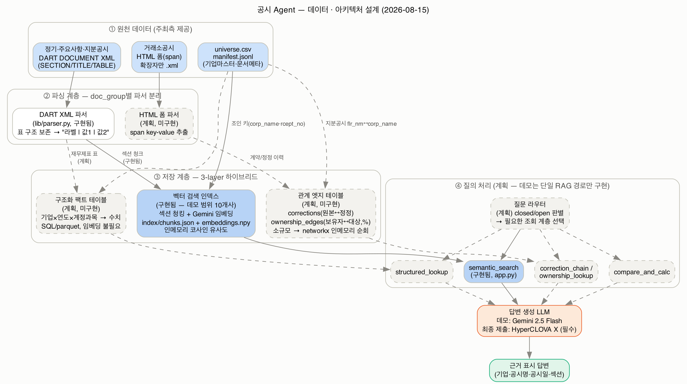

# 공시 Agent — 데이터 · 아키텍처 설계

작성일: 2026-08-15 · 대상: 제10회 2026 미래에셋증권 AI Festival "공시 Agent" 과제



> 실선/파란색 = 이미 구현됨(데모). 점선/회색 = 설계는 확정, 구현은 다음 단계.

---

## 1. 설계 목표와 전제

- 모든 참가팀이 **같은 데이터셋, 같은 LLM(HyperCLOVA X)**을 쓴다 → 팀 간 모델 성능 격차는 작을 것이고,
  **데이터 전처리·색인 설계의 완성도가 변별 요인**이 될 것이라고 판단했다.
- 평가문제는 closed(단답형)와 open(서술형)이 섞여 나온다. **closed형을 거의 다 맞혀야 open형 평가로
  넘어갈 수 있다**고 보고, closed형의 정확도를 구조적으로 보장하는 것을 최우선 목표로 삼았다.
- 근거 표시·환각 방지가 평가지표에 명시돼 있어, 모든 저장 계층은 **원본 공시(rcept_no)까지 추적 가능한
  메타데이터를 유지**해야 한다.

## 2. 왜 3-layer 하이브리드인가 — 단일 DB로 안 되는 이유

EDA 과정에서 데이터가 성격이 다른 세 종류로 나뉜다는 게 확인됐다:

| 데이터 성격 | 예시 | 필요한 조회 방식 |
|---|---|---|
| 완전 정형 | universe.csv, manifest.jsonl, 재무제표 요약표 | SQL 필터/조인 — 임베딩 불필요 |
| 반정형 서사형 | 정기공시 본문(사업개요·위험관리 등) | 의미 기반 검색(RAG) |
| 얕은 관계형 | 정정 이력, 지분/계열 보유 관계 | 1~2-hop 링크 — 그래프 DB까지는 불필요 |

그래서 **정적 DB냐 Vector DB냐 Graph DB냐**를 택일하지 않고, 계층별로 다른 도구를 쓰는 하이브리드로
설계했다. 아래 3개 계층은 각자 독립적으로 조회 가능하고, 질문 라우터가 필요한 계층만 골라 쓴다.

### 2-1. 구조화 팩트 테이블 (계획, 미구현)

재무제표 표(매출액·영업이익·자산총계 등)를 `(corp_name, base_year, base_month, account, value)` 형태로
파싱해 SQL/parquet에 저장. 정기공시의 "요약재무정보" 표는 `<TR><TD>계정과목</TD><TD>금액</TD>...</TR>`
구조가 항상 일정해서(`lib/parser.py`의 `_table_to_text`로 이미 검증됨) 파싱 난이도가 낮다.

**이게 되면 closed형 수치 질의는 RAG를 아예 거치지 않고 SQL 한 줄로 100% 정확하게 답할 수 있다** —
할루시네이션 리스크 자체가 사라지는 구간이라 leverage가 가장 크다. Gemini 데모에서 순수 RAG로
같은 질문을 던졌더니 정답은 맞혔지만 "요약재무정보" 표가 아니라 우연히 "경영진단" 섹션의 서술에서
답을 찾아온 사례를 실제로 확인했다 (`eval/eval_set.json` Q-07 검증 중) — 구조화 계층이 없으면 정답률이
운에 좌우된다는 걸 보여주는 사례.

### 2-2. 벡터 검색 인덱스 (구현됨 — 데모 범위)

서사형 텍스트(사업의 개요, 계약 조건, 위험관리 등)를 섹션 단위로 청킹해 임베딩. 청크마다
`corp_name / rcept_no / report_nm / rcept_dt / section` 메타데이터를 필수로 붙인다 — "모든 답변에
근거 공시 표시" 요구사항이 이 메타데이터 없이는 불가능하기 때문.

- 파서(`lib/parser.py`): DART DOCUMENT XML의 `SECTION-1`/`TITLE(ATOC=Y)`/`TABLE` 구조를 그대로 활용.
  정기공시는 반도체·은행·보험·증권 4개 업종을 비교해도 **I~XII 표준 목차가 100% 동일**함을 확인했기
  때문에, 섹션 경계를 찾는 파서 하나로 70개사 전체를 커버할 수 있다는 전제로 설계.
- 청킹(`lib/chunk.py`): 문단(`\n\n`) 단위로 묶어 1,200자 내외 청크 생성.
- 임베딩(`lib/gemini_client.py`): 데모는 `gemini-embedding-001`(3072차원). 최종 제출 시 HyperCLOVA X의
  임베딩 API로 교체 필요.
- 검색(`lib/index.py`): 청크 수(현재 551개, 10개사×4섹션 규모)에서는 전용 벡터 DB 없이 numpy 코사인
  유사도 인메모리 검색으로 충분 — 70개사 전체로 확장해도 수만 청크 수준이라 같은 방식으로 버틸 수
  있을 것으로 예상되나, 확장 시 재검토 필요.

**안전장치**: 일부 대기업은 특정 섹션(예: 카카오 "I. 회사의 개요")에 정관 전문·주식발행 이력까지
포함돼 있어 섹션 하나가 수십만 자에 달하는 경우를 실제로 발견했다 (`get_top_sections`의 `max_chars`
캡으로 대응). DART XML의 SECTION 중첩 깊이도 기업/보고서마다 미묘하게 달라서(하이브 사업보고서에서
"요약재무정보" 매칭이 의도보다 큰 컨테이너를 잡는 경우 확인), 표준 목차가 같다고 내부 트리 구조까지
같다고 가정하면 안 된다는 게 실제로 확인된 함정이다.

거래소공시(exchange)는 확장자만 `.xml`이고 실제 내용은 span 기반 HTML 폼이라 **별도 파서가 필요**
(`parser_html`, 계획 단계) — DART XML 파서와 절대 같은 파서로 처리할 수 없다.

### 2-3. 관계 엣지 테이블 (계획, 미구현)

당초 "그래프가 필요한가"를 두고 논쟁이 있었다. 결론은 **필요하지만 전용 그래프 DB 엔진은 과하다**였고,
그 근거는 실제 데이터로 검증했다:

- 지분공시(holding) 1,083건 중 제출인(`flr_nm`)이 우리 70개사 유니버스 안에 있는 경우가 **11개사,
  71건** 존재 — 즉 우리 유니버스 회사끼리 서로 지분을 보유하는 관계가 실재한다.
- 현대차그룹만 봐도 현대모비스↔현대자동차↔기아↔현대오토에버↔현대로템↔현대제철이 노드 6개·엣지 7개로
  얽혀 있고, **기아↔현대모비스는 순환출자**(양방향 보유)까지 확인됨.
- 정기공시 안의 "계열회사 현황(상세)", "타법인출자 현황(상세)" 섹션도 회사-회사 관계 데이터를 담고
  있다(예: POSCO홀딩스는 계열사만 50개, 상장 6·비상장 44).

노드 수(제출인 고유값 96개) · 엣지 수(1,083건) 규모에서는 Neo4j 같은 전용 그래프 엔진 없이
**엣지 테이블(`holder, target, pct, date, source_rcept_no`) + Python 메모리 상의 networkx 순회**로
순환출자 탐지·다단계 추적이 충분히 가능하다는 게 결론. 정정 이력(`corrections(original_rcept_no,
correction_rcept_no)`)도 같은 방식으로 얕은 링크 테이블이면 충분 — 거래소공시 정정비율이 43%(주요사항
보고서 28.9%)에 달해 이 테이블 없이는 "최신 계약조건" 류 질의가 구조적으로 틀릴 위험이 크다.

## 3. 질의 처리 파이프라인 (계획)

```
사용자 질문
  → 질문 라우터: closed/open 판별, 필요한 조회 계층 추론
  → [structured_lookup | semantic_search | correction_chain/ownership_lookup | compare_and_calc]
      (여러 개 조합 가능 — 예: 비교 질의는 structured_lookup 2회 + compare_and_calc)
  → LLM이 조회 결과만 근거로 답변 생성 (근거 없는 내용 생성 금지)
  → 근거 표시(기업·공시명·공시일·섹션) 포함해 출력
```

툴을 10개씩 만들지 않고 4~5개로 좁힌 이유: 툴이 많아지면 "질문 의도 파악 → 필요한 툴 추론" 자체가
어려워진다는 문제의식이 팀 회의에서 있었고, 각 툴이 위 3개 저장 계층에 1:1로 대응하도록 설계하면
라우터의 판단 범위가 좁아져 이 문제가 줄어든다.

현재 Gemini 데모(`app.py`)는 이 중 **semantic_search 경로만** 구현돼 있다 — 나머지는 다음 단계.

## 4. 현재 구현 상태 vs 목표 (격차)

| 구성요소 | 상태 | 비고 |
|---|---|---|
| DART XML 파서 | ✅ 구현 (`lib/parser.py`) | periodic 기준. major/holding도 같은 스키마라 재사용 가능할 것으로 예상, 미검증 |
| HTML 폼 파서(exchange) | ❌ 미구현 | |
| 벡터 검색(semantic_search) | ✅ 구현 (10개사, FY2025 사업보고서만) | 70개사·전체 문서유형으로 확장 필요 |
| 구조화 팩트 테이블 | ❌ 미구현 | closed형 정확도의 핵심 — 다음 단계 최우선 |
| 관계 엣지 테이블(정정/지분) | ❌ 미구현 | |
| 질문 라우터 / 툴 라우팅 | ❌ 미구현 | 데모는 검색 경로 1개만 고정 |
| LLM | Gemini 2.5 Flash (데모) | **최종 제출은 HyperCLOVA X 필수** — 교체 안 하면 평가 제외 규정 있음 |
| 평가용 API 서버 | ❌ 미구현 | 제출 마감 09.06, End-point + 스키마 명세 필요 |

## 5. 다음 단계 제안

1. 구조화 팩트 테이블 파이프라인 — 재무제표 요약표 → SQL 자동 추출 (leverage 가장 큼)
2. 70개사 전체 · 4개 문서유형 전체로 벡터 인덱스 확장, exchange용 HTML 파서 추가
3. 정정/지분 엣지 테이블 구축 + networkx 기반 순회 함수
4. 질문 라우터 프로토타입 (closed/open 판별 → 툴 선택)
5. HyperCLOVA X로 LLM 교체, 평가용 API 서버 스펙 확정
